# Microsoft Kernel Memory & Semantic Kernel 的整合應用


# Day 1, LLM - Structured Output

Link: [簡報](https://www.facebook.com/share/p/1DcJTse4C6/)

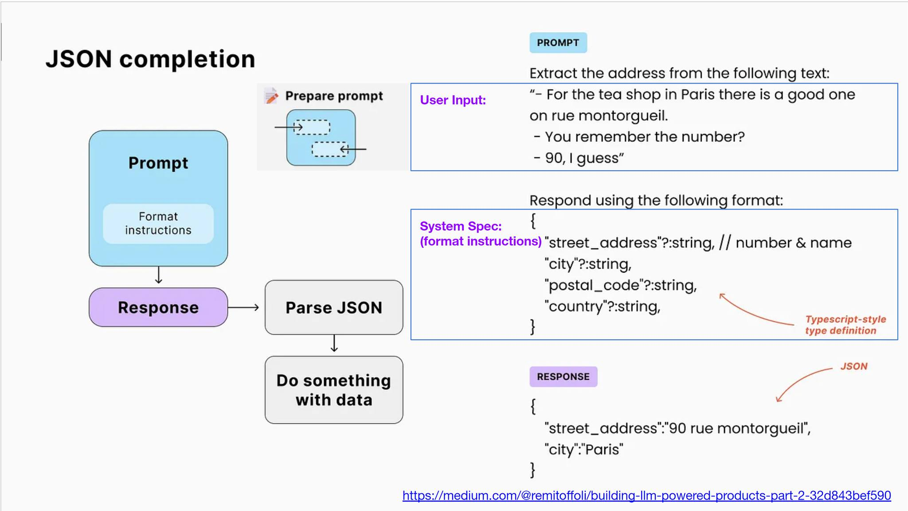


這是我在 .NET Conf 2024 的其中一張簡報, 今天想聊一下這題..

>
> Developer 應該怎樣善用 AI?
>

別誤會了，我沒有要聊 GitHub Copilot / Cursor 寫 code 有多厲害, 那個大家講到爛了, 我來講並沒有比較厲害, 反正用 AI 輔助 coding 早就不可逆了, 用就對了。我要談的是, 如果把 LLM 當作你的可用套件或是服務之一, 你會怎樣應用在你的 Application? 當 LLM 在各位開發人員手上, 各位你知道你手上的武器有多大的威力嗎?
這頁簡報，談的是先進的 LLM ( 我拿 GPT4o-mini 當分界 )，開始正式支援 Json Schema. 圖中的例子是要從一段對話, 擷取出對話中提及的那家 tea shop 正確的 address .. 如果這是別人問我的問題，我第一時間的反射動作一定是:

>
> ChatGPT, 告訴我下列對話提及的地址...
> (貼上對話內容)
>

如果我還有其他雜七雜八的要求，我一定一起丟給 ChatGPT 幫我處理，例如找出附近的景點，或是多告訴我那個地點的相關資訊等等。但是 ( 就是這個 BUT )，如果這功能是要埋在你某個 application 內呢? 如果你有幾百萬組這樣的對話，你都要抽出地址資訊呢?
反射式回答: 那就 call chat-completion api 就好了啊...
不過，你是 Developer, 你其實可以想得更多一點。我試著多列幾個思考題:

1. 1. 你要 LLM 用什麼格式回答你?
2. 如果有 1% 的機率 LLM 回答不出來，你程式能怎麼判斷?
3. 你還該讓 LLM 處理雜七雜八的要求嗎? 通通寫在 prompt 讓 AI 一氣呵成比較好? 還是取得地址後自己打 google map api 處理比較好?

1. 開發應用程式就是這樣，依靠開發團隊的經驗，把處理過程寫成應用程式，使用者就能站在你的肩膀上不用再踩一次地雷。如果你的服務使用量夠大，你的一念之間的決定可能影響著巨大的效率提升..
這才是身為 Developer 的職責，也是身為 Developer 的優勢。這世界有更多這種新的服務需要開發，要讓 AI 來開發 AI 的應用程式，現階段也還沒那麼容易，這會是 Developer 大顯身手的地方。回到這題來看，你會發現你平常在 ChatGPT 下的 prompt, 都不見得適合直接拿到程式內使用。
那麼怎麼弄才是 Developer 的作法?
上面的問題，我的答案是:

1. 用 Json output  
最好還能定義 Json Schema, 拿到結果後立刻 deserialize 成 C# object, 以利後續讓非 AI 的程式碼能無縫的接手處理。
2. 直接在 output 就 "明確" 標明執行結果成功或失敗  
(就像 HTTP status code 一樣)，不要用猜的，對你好，對 LLM 也好。明確的讓 AI 輸出能否判定答案 (輸出地址)，比起你自己 parsing 後再丟出 exception 優雅的多。LLM 的幻覺跟不確定性已經夠多了，不需要多妳一個..
3. 單一職責，只讓 LLM 處理非他不可的任務就好。  
其餘任務，只要用 json 傳出必要資訊，用程式碼來處理就夠了。講直白一點，搜尋，格式轉換，數值計算等等，這些都是 code 來處理遠遠強過 LLM 的領域。你不需要為了少打那幾行 code (都可以 AI coding 了)，結果原本幾百個 CPU instructions 能處理完畢的事情，變成每次都花費幾百個 tokens 才能處理... 你知道一個 Azure Function Call 的費用，跟一個 ChatCompletion API Call 的費用差多少嗎? 別忘了妳的決定會被放大 100 萬倍....
所以，回到這張簡報，你知道為何你該了解 LLM 的 Json Mode 了嗎? 實際的 code 我就不貼了，這是我在 03/25 直播的前半段會提及的 AI APPs 開發基本技巧的內容 XDD，因為我必須交代完他，我才能讓大家充分體驗我要談的主角: Microsoft Kernel Memory 啊 ...

當天，這個案例 (還包含接下來我每天會貼一則案例)，我會用 OpenAI 的 ChatCompletion API 當基礎，我會分享:
- 用 Http Client 示範
- 用 OpenAI .NET SDK 示範
- 用 Microsoft Semantic Kernel 示範

用不同方式寫這段 code... 其實有很大的差別。SDK 相依姓的取捨，跟帶來的便利，你要懂得之間的差別。別以為只是 call API 就結束，如果你看到你 call api 要自己寫 json schema, 而用 semantic kernel 的時候只需要給 C# type, 你的想法就會改變了...

## Demo

1. Simple Chat
- HTTP Client
- OpenAI .NET SDK
- Microsoft Semantic Kernel

2. Structured Output
- HTTP Client
- OpenAI .NET SDK
- Microsoft Semantic Kernel


# Day 2, LLM - Function Calling (Basic)

Link: [簡報](https://www.facebook.com/share/p/1BozfZzzov/)

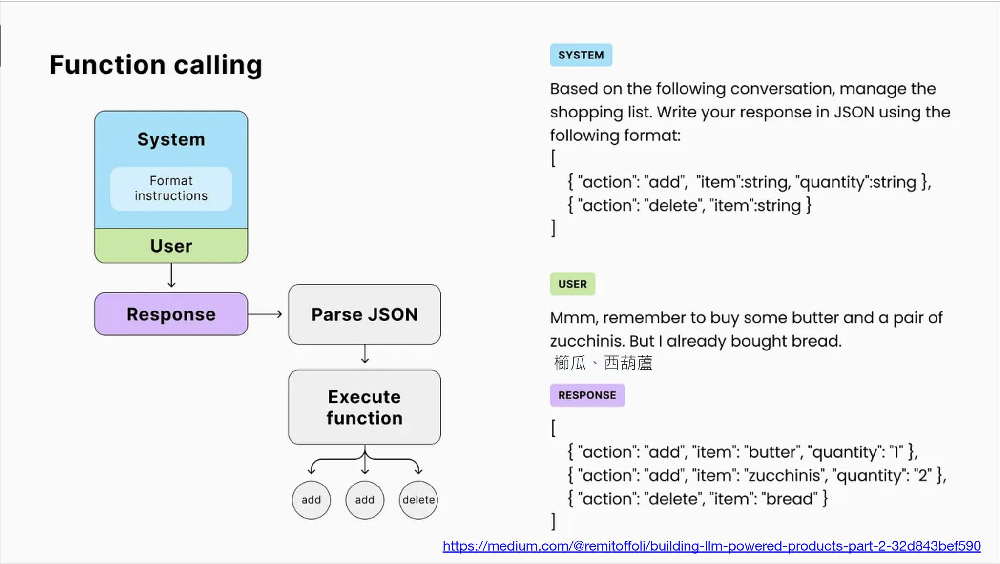

昨天聊完 Json Mode, 今天繼續來聊聊 Function Calling... 同樣是我在 .NET Conf 2024 的簡報...
Function Calling (或稱為 Tool Use), 我覺得這是 LLM 普及以來, 威力最大的功能了。就因為 LLM 有了這能力，才開啟了各種 Agent 以及透過 AI 來主控各個週邊系統的能力。所有想要在你的 App 內應用 LLM 的 Developer, 請務必要搞清楚 Function Calling 是怎麼回事, 這我認為是下個世代最重要的基礎知識了。
我先分解動作，今天只聊基本動作，明天再來談連續動作...。昨天聊到 Json Mode, 當你問 LLM 問題，指定 LLM 要用你提供的 Json Schema 輸出 Json Object, 這能力其實是開啟了 LLM 跟 code 之間 (用 json) 資料交換的通訊基礎了。而 Function Calling, 則開啟了 LLM 跟 code 之間的函數呼叫 ( 正是 Function Calling ) 的通訊基礎。蹭一下最近不知道在紅什麼的 MCP, 其實就只是 Function Calling 的實體化通訊協定。
Function Calling 是在對話開始之前, 預先告知 LLM 你有那些 "Function" 可以使用? 然後在對談過程中，讓 LLM 自己決定他要告訴 User 結果 ( Text ), 或是他要先執行指令 ( Function ) 並看看結果後再決定 ( 繼續執行指令 Function , 或是直接給結果 Text ) ?
極度簡化過的基本型，就如這頁簡報，一開始的 system prompt, 我告訴 LLM:

```text

Based on the following conversation, manage the shopping list, 
write your response in JSON using the following format:

[
  { "action": "add", "item": string,  "quantity": string },
  { "action": "delete", "item": string }
]

```

告知有哪些動作 ( action + parameters ) 可以用來維護購物清單後，接著就是給他需求:

```text

Mmm, remember to buy some butter and a pair of zucchinis. 
But I already bought bread.

```

推理能力夠好的 LLM 就能夠解讀這段對話的意圖。知道這段對話要提醒你記得買奶油，兩個櫛瓜 (我今天才知道這字的意思 XDDD)，麵包我已經有了不用再買。
依靠強大的推理能力，跟前後文 (其實這裡也包含了昨天介紹 Json Mode 的能力)，LLM 已經能將這段對話的意圖，用你給他的指令集表達出來。某種程度，已經是自然語言跟你給他的指令集的編譯器了。這些對話，你貼在幾個主流的 LLM 都能得到一樣的答案:


```json

[
  { "action": "add", "item": "butter", "quantity": "1" },
  { "action": "add", "item": "zucchinis", "quantity": "2" },
  { "action": "delete", "item": "bread" },
]

```

基本上這樣已經完成一大半了, 都已經用 Json 告訴你接下來該依序執行那些指令了, 剩下的只要寫一段 code, 依序真的執行這些指令就能真的完成任務了。
這就是 Function Calling 的基本原理, 當然實際應用不需要這麼土炮, API / Framework 層級都有更方便使用的模式, 不過 LLM 變化快速, 我高度建議大家還是要搞懂這原理。某些情況下 (例如你同時要 call 前端跟後端的 function)，你沒辦法用內建的機制來運作，或是你要處理更高層級的 Planning 時, 你都會需要自己手動下這樣的 Prompt..
回到 Function Calling, 其實到這裡為止, 你只完成了 "Call", 還沒完成 "Return" ... 更完整的應用案例，我留到明天第三頁簡報再來聊~


## Demo

1. Extract Address
- HTTP Client
- Microsoft Semantic Kernel


# Day 3, LLM - Function Calling (Case Study)

Link: [簡報](https://www.facebook.com/share/p/12GFiqp8MnL/)

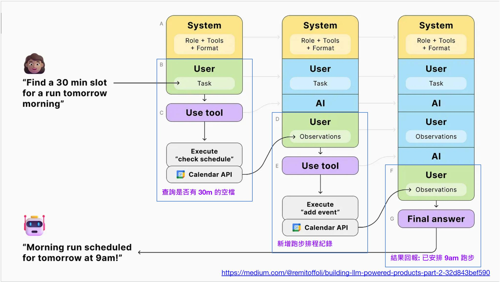


昨天談完 Function Calling 的基本型態, 今天來看看實際上可以做出什麼類型的應用吧~
簡單的說，推理能力夠好的 LLM, 已經有辦法從:

1. 可用的指令規格
2. 你的意圖

直接產生符合 (1) 跟 (2) 的對等 "指令執行順序" ..., 如昨天所說, 這是將文字敘述的意圖, 翻譯成指令集執行順序的編譯器了。這在過去不靠 AI 是完全做不到的事情，我才會說所有 AI 神奇的應用，大半都是從 Function Calling 的能力累積而來的。

不過，昨天只談了一半，解譯出 "指令執行順序(含參數)"，只有 "Calling" 啊，Function 應該是有 Return 結果的，而且有時應該要有順序相依關係的 (你要執行完 Func1, 拿到結果後才決定怎麼執行 Func2 ..)

於是，來看看這頁簡報 (同樣是來自 .NET Conf 2024 我那場的簡報) 吧。這情境是:

User: find a 30 min slot for a run tomorrow morning
(幫我找明早 30min 空檔, 我要慢跑)
先省略中間過程，我期待 AI 能幫我處理好所有事情 ( 按照要求 Booking 行事曆 )，並且回覆我這段訊息:

AI: Morning run scheduled for tomorrow at 9am !
(已經幫您預約好明早 9:00 慢跑)

這神奇的結果，是怎麼靠 Function Calling 辦到的? 我就列出檯面上 & 檯面下的對談過程，你大概就能理解這整件事的來龍去脈了。

1. system: tools: [ "check_schedules", "add_event" ]
1. user: find a 30 min slot for a run tomorrow morning  
送出這段歷程後, 第一次 AI 會回應:
1. tool: [ check_schedule( 03/21 06:00, 03/21 12:00 )]  
收到這段回應後, 代表 AI 需要叫用 check_schedule 這工具, 並且給他時間範圍, 明天 (03/21) 的 06:00 ~ 12:00...  
當你的應用程式, 代替 AI 執行完這段指令, 並且回覆結果 ( append 對話紀錄 )
1. tool-result: [ "07:00-08:00, 起床換裝", "08:00-09:00, 吃早餐", "10:00~12:00, 跟同事視訊會議" ]  
送出後, AI 得到結果，判定思考後，會再次送出這回應:
1. tool: [ add_event( 03/21 09:00 - 09:30 )]  
同上面的過程，AI 表達他需要使用 add_event 這工具。你的應用程式應該替他執行並且給 AI 執行結果:
1. tool-result: [ "success" ]  
再次送出結果給 AI，最後 AI 判定任務完成，就彙整上面的過程，最後直接回應這訊息:
1. assistant: morning run scheduled for tomorrow at 9am!

以上就是完整的對話過程。這邊留意，我標示的 (1) ~ (7), 是 chat history 的序號跟內容。每次呼叫 AI Chat Completion，都是把 history 當下為止的所有內容 (從 0 開始) 都送出去。

- system 代表 system prompt, 最高優先權, 背景設定用
- user 則代表使用者直接輸入的訊息
- assistant 則代表 AI 要回應給使用者的訊息

其中 tool 代表 AI 回應給 APP 的訊息, 需要 APP 檯面下替他執行這指令，而 tool-result 則是 APP 執行後在檯面下回覆 AI 執行結果的兩種特殊 message. 每次呼叫 AI Chat Completion, AI 就都能根據目前的前後文做出下一步的決定，直到完成任務為止。


是否很神奇? 原來這一連串不可思議的動作，其實拆解下來也很普通，就真的是昨天介紹的基本型態 function calling, 以及前天介紹的 structure output 的組合應用而已。實際上的狀況是，你要寫這種應用程式不用那麼辛苦，跟我一樣土炮這整個過程... 這過程主要是研究用，當你搞清楚後，有很多成熟的 framework 可以讓你簡化這一連串的動作。

這部分我就不推薦直接使用 Http, 也不推薦直接用 OpenAI SDK 了, 因為你程式碼要處理的細節太多, 你可以直接選擇成熟的框架 ( 例如: Semantic Kernel )，成熟的 No Code 平台 ( 例如: n8n, dify )，或是成熟的 LLM Client + MCP server ( 例如: Claude Desktop, Cursor ... ), 其實都是在做同樣的事情。

連續三天，看到這邊，是否有解開一些疑問? 是否想通了 AI 這些神奇的能力是怎麼被創造出來的? 這三部分，我常常都稱他為 AI 時代的開發基礎技巧，它的重要性不亞於當年我剛開始學寫程式時，書上交給我的基本流程控制技巧 ( 例如: If, For Loop 等等 )。我強烈建議所有的 Developer, 應該把這些應用方式當作基礎能力, 確實的掌握清楚後再來學各種框架或是快速開發的技能。

## Demo

1. Schedle Event Assistant
- HTTP Client
- Microsoft Semantic Kernel


# Day 4, LLM - RAG with Function Calling

Link: [簡報](https://www.facebook.com/share/p/16HVPbinAY/)

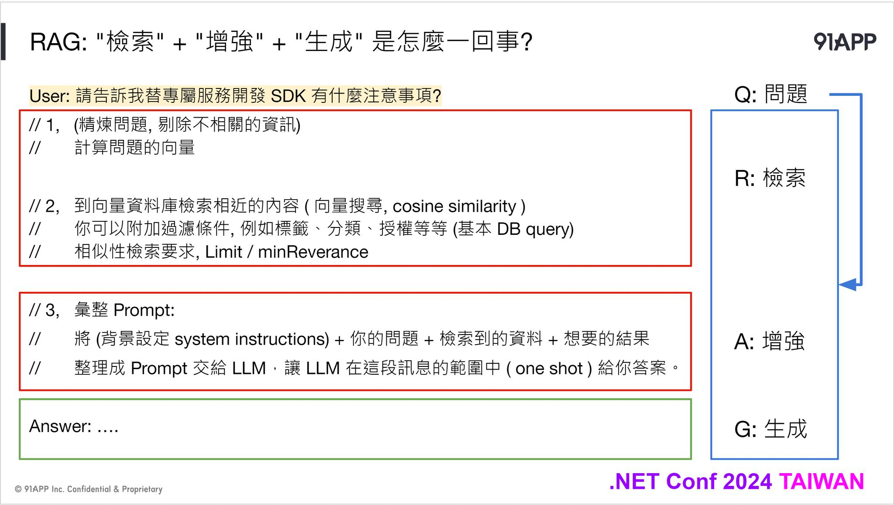


講完 Json Mode, Function Calling 之後, 今天的主題是: RAG
同樣截了張我在 .NET Conf 2024 的一頁簡報, RAG ( 檢索增強生成, Retrieval Augmented Generation ), 其實就是用檢索的技術, 讓 LLM 依據這些檢索的結果來生成內容 (回答) 給使用者的技巧。若沒有 RAG, LLM 則會用他被訓練得那些知識來回答。這些來源通常會有幾個月以上的時間差，而且會因為訓練內容的不同而有所偏差...
這邊我把 RAG 分成兩段來看，一個是 RAG 本身的處理流程，另一個是如何觸發 RAG 的運作機制。處理流程其實並不難懂 (難的是怎麼調教到精準 & 滿意)，分成幾個步驟:
1. 先收斂 "問題"，把她轉換成檢索內容的條件或查詢
2. 檢索出相關內容 (一般而言都是到向量資料庫，但是非必要，你要到全文檢索系統，或是搜尋引擎其實也可以)
3. 將上述這些資訊組合成 prompt, 讓 LLM 依據你提供的內容 (2), 搭配 (1) 的問題，讓 LLM 替你彙整生成最後的答案
其實這就是 RAG 的基本流程了。不過我刻意把 RAG 擺在 Function Calling, 其實這就是 Function Calling 的一種應用啊..
試著看一下這段 system prompt:


```
你的任務是協助使用者，代替他到 xxxxxx 檢索資料，並且依據這些檢索的結果來回答使用者的問題。回答問題時請附上檢索的來源網址，並且請勿回答檢索內容沒有提及的內容
```

如果你又很剛好的，有給他這個 "tools" 的定義的話.. ( 回想前面的 Function Calling 案例 )，那麼 LLM 就會自動將你提問的問題，解讀成要先 "檢索" ，然後再回答內容。而這整個過程，其實就是靠 Function Calling 觸發的。
至於要給搜尋引擎的條件與參數 ( 例如 query, limit, tags 等等過濾條件 )，其實就是靠 Json Mode, 將呼叫這 Function 需要的各種參數，從前後文抽取出來 ( 還記得聊 Json Mode 時, 從對話中抽取格式化的地址資訊這例子嗎? )。這些資訊都備齊，LLM 就能隨時指示你的 AI APPs, 該替 AI 去呼叫搜尋引擎了 ( 指令跟參數 LLM 都幫你準備好了 )
如此一來，你的對談內容，突然就搖身一變，從原本只能回答 LLM 腦袋本來就有的世界資訊之外，他彷彿開始懂得使用 Google 了一般，當你問了他不知道，或是他判斷應該去 DB 檢索的時候，他就會自動呼叫搜尋引擎，並且自己生成必要的查詢參數，找到結果後消化吸收，再變成答案回覆給你。感覺很熟悉嗎? 沒錯，這就是 Search GPT 這類功能的工作原理，弄懂它之後，你也有能力自己實作一樣的功能，並且可以把 Search 的對象換成自己的知識庫。
看到這邊，如果你熟悉 Function Calling 的使用技巧，要做出 Search GPT 其實是輕而易舉的事情。03/25 我有準備一個範例程式，我用 BingSearch ( 人家有現成的 API + SDK, 我為了方便 demo 就拿來用了 ) 當作 Plugins 掛上 Semantic Kernel, 同時也掛上了幾個其他的 Plugins ( 例如回答我現在在哪裡，現在的天氣資訊等 )，你就可以這樣問他:
"請問我現在這邊有哪些值得逛逛的景點? 以及提醒我出門前應該準備哪些東西"
推理能力夠好的 LLM，就會聰明的充分運用他手上所有的工具，會先去查你在哪裡 (我只回應到 City)，會查你當地現在天氣，然後根據地點去搜尋引擎找資訊，並且提醒你要不要帶傘，或是穿外套等。
你會發現，到最後你只要選擇一個夠可靠的檢索服務就夠了 (你不一定要從零開始，自己用向量資料庫慢慢打造)，只要他能夠被當成 Semantic Kernel 的 Plugins, 就能被 LLM 納入他的工具箱內，需要時隨時取用了。那個檢索服務最合適? 我鋪梗鋪那麼久，主角終於能現身了，就是 Microsoft Kernel Memory ... , 明天就來聊這個服務能幹嘛 ?


## Demo

(Semantic Kernel ONLY)

1. RAG Basic ( custom prompt )
1. RAG with Bing Search


# Day 5, RAG as a Service, Microsoft Kernel Memory

Link: [簡報](https://www.facebook.com/share/p/162CgFvQs8/)

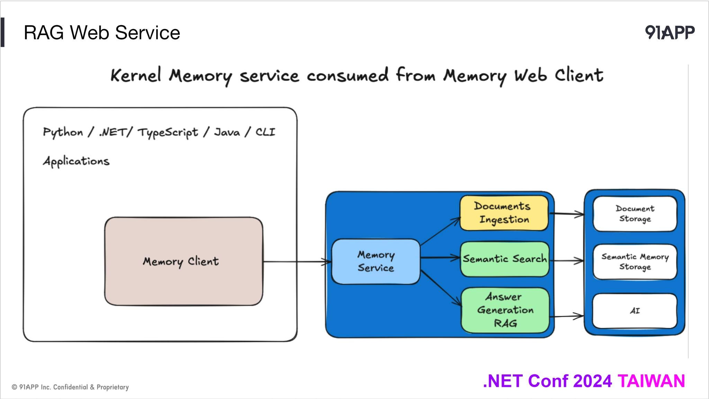


鋪了四天的梗, 第五天終於來到正題, 今天就直接來聊聊 Microsoft Kernel Memory 這個 open source project 吧~
Microsoft Kernel Memory ( 以下簡稱 MSKM ), 背後的開發團隊跟 Semantic Kernel ( 以下簡稱 SK ) 是同一個團隊，因此有幾個地方, 是 .NET 人員可以期待的。不但架構設計上格局夠大，可以橫向擴充到極大的規模，也可以小到像 SQLite 那樣內嵌在你的應用程式內。而軟體功能的擴充性也很棒，除了有各種 AI service 的連接器之外，文件匯入 MSKM 的 pipeline, 你也可以完全自訂自己的 handler, 將自己的邏輯內建在 MSKM 內..
這次我截了兩頁簡報，分別代表了 MSKM 的兩種應用方式。第一個是 as web service, 你可以透過 http api 來存取 MSKM, 或是你也可以用 serverless 的模式, 直接把整套 MSKM 核心機制直接內嵌在你的應用內 (不是跑個 localhost 再用 http api 的做法喔)，基本上已經顧及到各種規模跟應用的方式了。
回到 MSKM 這專案本身，他要解決的環節，主要就是 AI APP 最棘手的 " long term memory " 的管理問題。在 SK 內，短期記憶是用 Chat History 來處理的，而長期記憶只是定義了 Memory ( Vector Store ) 來處理。不過，仔細看他的說明，你會發現 Memory 其實比較像是抽象化的向量資料庫，有點像 EF (Entity Framework) 之於關聯式資料庫，Vector Store 就是讓你定義你的 Vector Store 結構，方便你 CRUD，並且直接定義好相似性檢索的 interface ..
但是如果你理解 RAG ( 尤其是 document ingestion ) 怎樣匯入文件內容的話，你會發現，從內容的文字化，內容的分段，合成，貼標籤，向量化，寫入，查詢... 這一大段的流程，SK Memory 只處理了最後一小段而已
所以，MSKM 這專案就因為這樣，被獨立出來了。由於你要做大量文字的處理，通常也很吃你的長時間任務處理的機制是否成熟 (大概就式分散式任務處理那類的問題)，因此與其像是 SK 那樣用 Framework 的方式發行，MSKM 則選擇用了 "獨立服務" + SDK 的方式來發行。你可以直接拿 source code ( 從 github clone ) 來使用，你也可以直接從 docker hub 拉 image 回來直接部署 ( 不用寫 code )，在呼叫端你可以直接用他的 NuGet Package ... 都是為了這個目的而設計的
而被當成獨立服務來看待，那 MSKM 跟 SK 就算是同一個團隊開發的，好像也沒有什麼特別的關聯... 這樣想你就錯了，我在這邊特別提兩個地方，特別適合兩者搭配使用的情境:
1. MSKM 內建支援 SK 的 Memory Plugin
MSKM 已經在他的 NuGet package 內準備好 SK 使用的 Memory Plugins 了，你可以直接將他掛上 SK Plugins 內使用的。一旦掛上去之後，其實你就等於替 AI 追加了一組能直接操作 MSKM 的 tools 了。前面聊到的 Function Calling, 你可以想像 MSKM 支援的功能也都能被 AI 判斷與呼叫使用了
2. MSKM 本身也同樣是用 SK 開發的，SK 支援的各種 connector 你都不用擔心，都可以在 MSKM 上直接使用。例如 LLM / Embedding 的 AI 服務 ( openai, azure openai, ollama, claude ... 等等 ) 通通都支援
這一切這樣組合起來，我覺得是目前 .NET 領域最成熟的組合了，MSKM 不適合那種開箱即用，需要配套的 UI 跟管理工具的終端服務，她更適合的是給開發人員使用的獨立服務。既然對象是 Developer, 那麼先具備基礎的 AI APP 開發知識是必要的。這也是為何我會先安排 #1 ~ #4, 花了些篇幅先介紹前面的基礎知識，因為你掌握了這些，才能充分體會 MSKM 設計的精妙之處
--
同樣又來到葉配時間 XDD
這些設計的精妙，很多巧思你沒真正看到 code 其實很難體會的，03/25 的直播我就不大再重複簡報的內容了，直接帶大家看滿滿的 sample code. 有興趣的請記得參加 03/25 的直播, 連結我放在第一個留言
--
預告 #6, 如果你這些技能都備齊了, 明天我要來聊聊用 SK + MSKM 示範一些進階的 RAG 應用方式, 請期待明天的葉佩文 ?


## Demo

1. RAG with Kernel Memory Plugins
1. RAG with Kernel Memory Custom Plugins
1. Demo from Kernel Memory Offical Repo
1. 


# Day 6, 進階 RAG 應用, 生成檢索專用的資訊

Link: [簡報](https://www.facebook.com/share/p/1AUSLJBR6Q/)

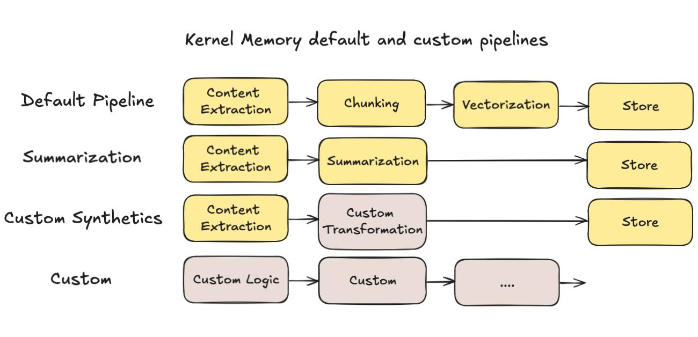

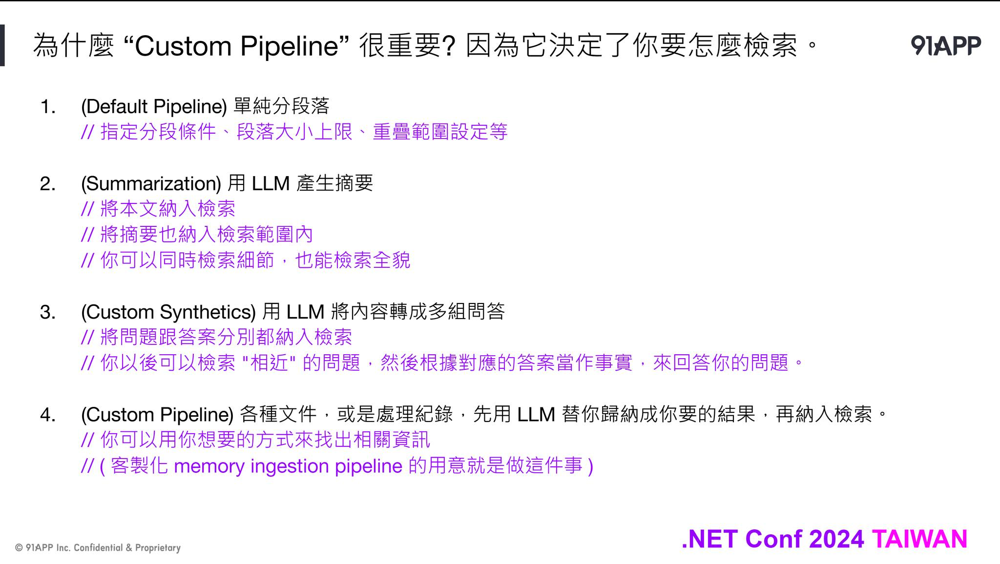

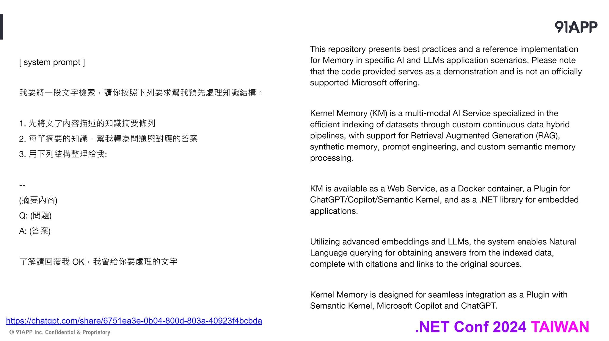

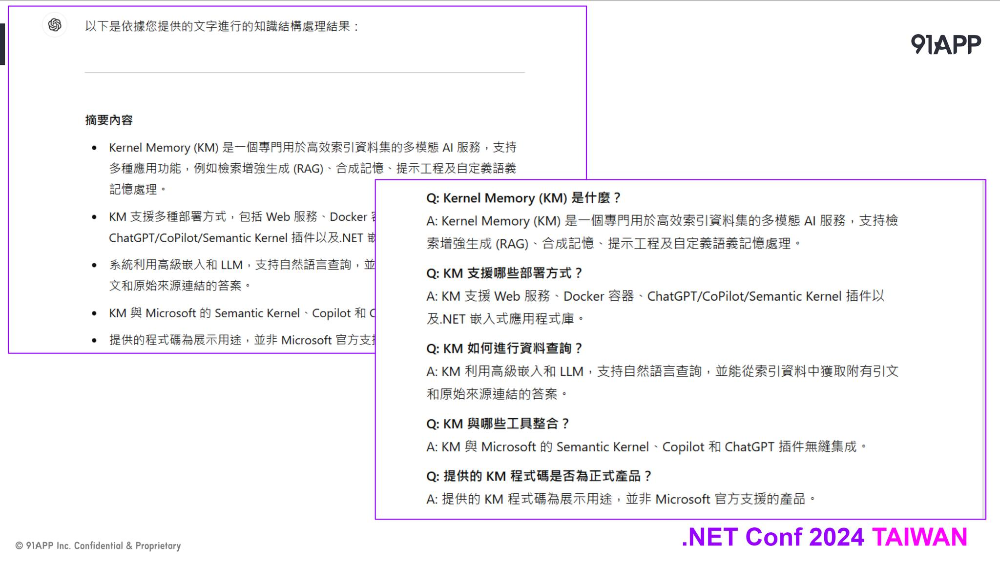

有了 SK ( Semantic Kernel ) 跟 MSKM ( Microsoft Kernel Memory ), 對於 RAG 這樣的應用, 我們開始有了高一層的控制能力了。今天就來聊聊面對 RAG 的應用時, 有哪些在設計之初就能改善檢索效果的技巧吧
大部分教科書, 都是教你要把內容分段 (分段有很多策略, 長度, 分段符號, 重疊範圍等等)，不過我實際拿我自己部落格文章來測試，老實說效果並沒有很好.. 拿最基本的 MSKM 預設設定 ( pipeline )，流程大致上是這樣:
1. 文字化 ( content extraction )
如果你的內容不是純文字, 會先有一個 handler 來處理。例如 PDF 先轉成文字, 或是圖片先進行 OCR 等等
2. 分段 ( chunking )
RAG 主要檢索用的技巧, 就是把內容向量化。向量化的模型通常都有最適合的內容大小。以我使用的 OpenAI text-embedding-large3 來說, 建議輸入是 512 tokens, 上限是 8191 tokens .. 文字太長的話就需要先分段, 也就是 chunking 在做的事情
3. 向量化 ( vectorization )
就是把 (2) 分段後的文字，逐段都交給模型轉成向量。這過程有的地方會稱他為 "內嵌" (embedding)
4. 儲存 ( store )
單純的把前面處理的資訊, 原始內容, meta data, 還有向量通通都存起來。一般會直接存到支援向量搜尋的 database, 作為後續檢索查詢使用的資料來源
然而，我實際拿我部落格文章測試，基本檢索其實還不錯，但是當我問題問的遠一點就很糟糕了。有在看我文章的人，大概都知道，我文章寫得很長... 初步統計一下，我部落格的 .md 檔案統計:
- 總共有 330 篇文章 ( 後期都是 .md , 早期用 .html )
- 單篇文章純文字內容, 約在 50k ~ 100k
而向量檢索的基本動作，是把你的詢問也轉換成向量, 然後拿著這向量 (query) 到資料庫內挑出相關度高的內容，最後把這些資料交給 LLM 合成最終答案。如果你不對你自己的檢索內容做任何調整，那麼一篇文章平均會被切成 100+ 個分段 ( partitions )，你的查詢，會從這些分段中找出相關度高的來使用。但是，資訊的密度根本對不齊，往往會得到牛頭不對馬嘴的狀況。
舉幾個例子，我寫了篇 WSL 的應用，花了很多篇幅介紹 WSL 應用的細節跟隱藏的地雷，然後有人問了 "WSL 能幹嘛" 的時候，你希望向量資料庫給你那些分段?
基本上這是無解的題目，因為給哪一段都不對啊... 除非我自己寫文章時候習慣很好，最前面的簡介就寫得很好，把整篇文章的摘要都濃縮在一個分段內，那麼 RAG 檢索時候這簡介應該會排到比較高的分數，會被拿來生成答案。
雖然有解法了 (我自己替每篇文章補上一段 1000 字以內的摘要..)，不過這時代有 LLM，我應該不用那麼辛苦才對。因此，我開始嘗試，能不能在把文章送進去檢索前，我自己先靠 LLM 生成我欠缺的部分? (摘要)
果然效果好的多，而且 MSKM 的 pipeline 也內建這機制了，你只要在 ImportText 時指定自訂的 pipeline, 加上 Summarization 這個 handler 就夠了。
不過我想做更多嘗試，因此我先選擇在 MSKM 外面先自己處理好內容，暫時沒有直接搬進 MSKM 的 Handlers. 除了前面做的摘要 ( summarization ) 之外，我多做了好幾種嘗試，包含:
1. 全文章的摘要 ( abstract )
2. 文章每個段落的摘要 ( paragraph-abstract )
3. 轉成 FAQ 清單 ( question / answer )
4. 轉成解決方案案例 ( problem / root cause / resolution / example )
其餘還有別的嘗試，我就不一一列出了。這效果比起之前無腦的 RAG 好得多，因為很多查詢的角度，我可以得到語意更正確的檢索結果了。除了前面提到的摘要之外，我拿 FAQ 跟解決方案當例子
我的文章寫了很多我解題的思路，但是大家應該都是抱著問題來找答案的，所以提出的查詢應該都是以問題為主 ( 包含: question, 也包含 problem, 中文都叫做 "問題"，其實意義上有區隔 )。
這是視角的問題，使用者用他的視角來詢問，而我用我的視角來寫文章內容。當兩邊的視角不一致的時候，單純向量化的相似性是挑不出兩者的關聯的。因此我主要解題的方向就是，靠 LLM 良好的推理與彙整能力，將我文章內容生成成對應視角的內容 (我列了那四項就是四種視角)，再把這些內容標上合適的 tags, 通通向量化加入檢索。
因此，應用的方式開始更靈活也更有趣了。由於這些是文章產生或異動時處理一次就好的任務，跟使用者查了幾次無關，因此我挑了貴一點的模型來測試 ( 我用 OpenAI 的 o1 )，效果還不錯，用 SK 先生成這些檢索用的內容後，再交給 MSKM 檢索處理。最後讓 AI APPs, ChatBot, Agent 等前端介面直接到 MSKM 查詢相關資訊，用 RAG 來生成最終答案回應使用者
當我搞懂這一切後，我才發覺 RAG 不應該是一套 "系統"，或是 "產品" 才對，她更像是 design patterns 那樣的設計模式，告訴你 AI 的知識檢索該怎麼做。RAG 終究需要做某種程度的客製化調整才會好用，因此你如果想做好 RAG，應該要有對應的技能，也要對你要檢索的內容，跟怎麼被查詢的方式有所掌握。最後你手邊應該要有一些你掌握度高的工具箱，必要時能隨時拿出來應用。這時 SK, MSKM, 還有其他 No Code 的 AI APPs 平台，都會是你的好幫手。


## Demo

1. Multiple Plugins Demo
1. Synthesize Content for RAG


# 7, MSKM 與其他系統的整合應用

Link: [簡報]()

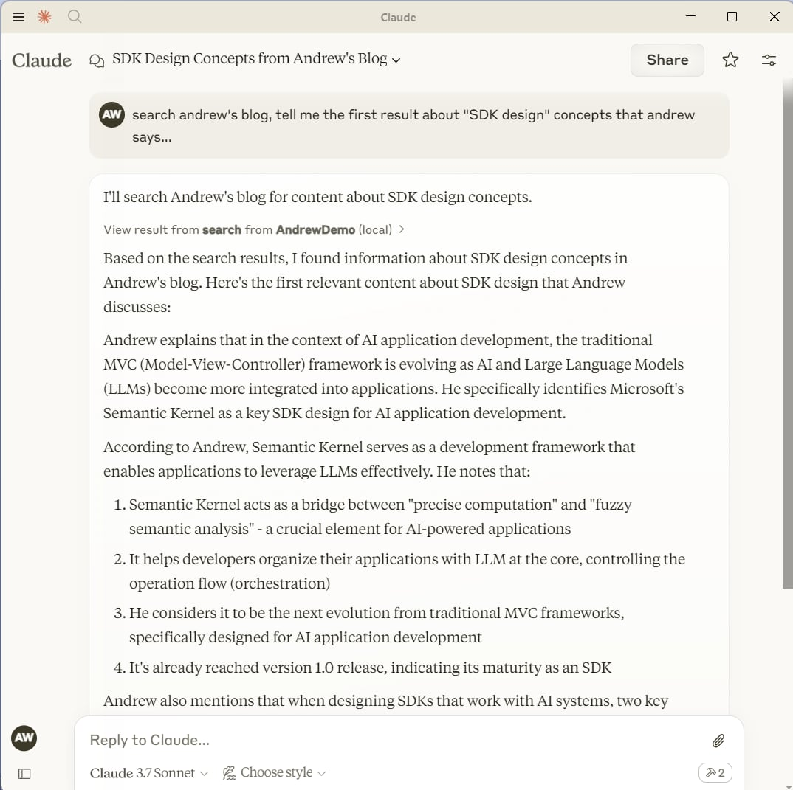
> MSKM MCPServer 直接掛上 Claude Desktop, 讓 LLM 直接搜尋我的部落格資訊的示範

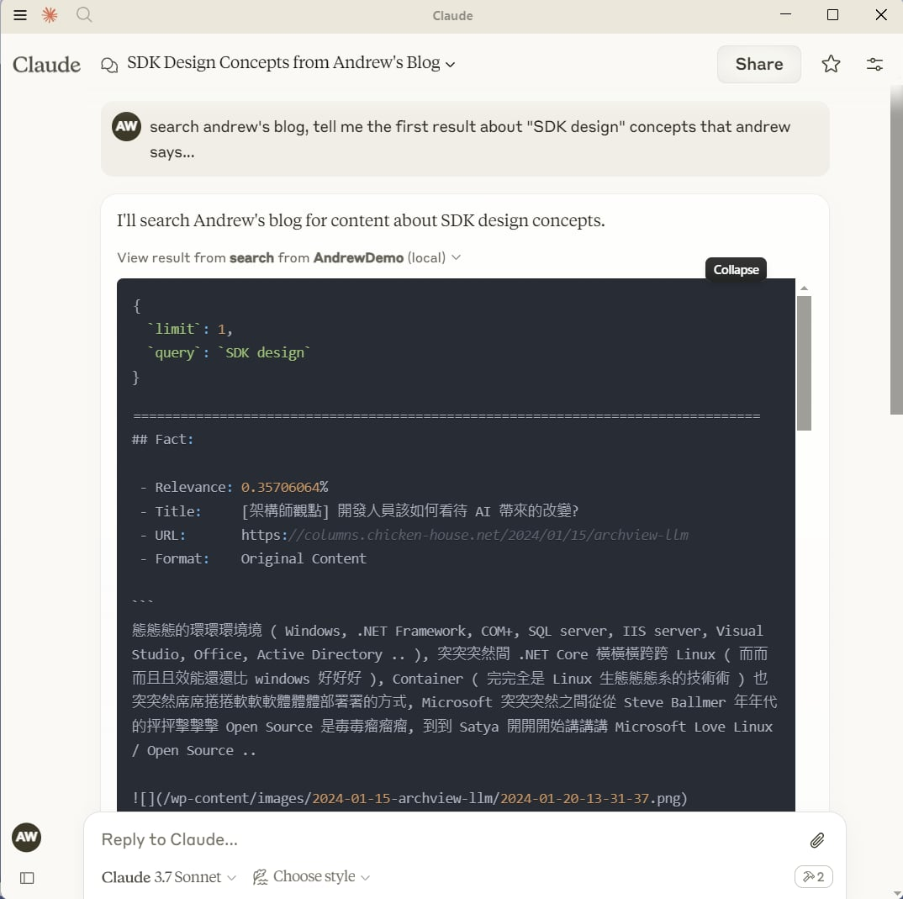
> 點開 Claude Desktop 呼叫 MCPServer 的過程，可以看到 MCPServer 從 MSKM 抓了哪些資訊餵給 LLM


前面聊了很多 function calling 的應用，但是主要的 demo 方式都是透過 SK + Plugins.

實際上 LLM 的 function calling 能力有很多種不同管道都能使用的，按照不同的 LLM 應用程式來區分，有這些用法:

1. 透過 Chat GPT (plus): 我在部落格文章, 還有 DevOpsDays Taipei 2024 介紹的是用 GPTs + Custom Action ( 透過 OpenAPI Specs + OAuth )
1. 透過 No Code Platform: 我在 .NET Conf 2024 介紹的是用 Dify + Custom Tools ( 也是透過 OpenAPI Specs )
1. 透過 Claude Desktop 等支援 MCP 的 Host: 這次會示範用 ModelContextProtocol 官方的 csharp-sdk, 將 MSKM 封裝成 MCPServer 使用
1. 自己 coding, 透過 Semantic Kernel 將 MSKM 掛上 Kernel, 讓 LLM 來驅動並且進行本地端的 (Native) Function Calling

這些方式，背後運作的流程其實都一樣。你都需要在一開始告知 LLM 有哪些 function 可以使用 (說明規格，參數)。而 LLM 在對話過程中會推論要完成任務需要依賴那些 function, 
藉著回應這些 function calling 的要求跟取得的回應, 來逐步完成任務。而這些不同的工具跟手段，說穿了只是用不同的方式在跟 LLM 溝通而已。

攤開來看，每種方式都巧妙地提供了兩件事:

1. 告知 LLM 可用的 function specs
1. Host 能有統一的方式代替 LLM 來執行指定的 function 並回傳 function result

回頭看看, OpenAPI Spec ( swagger ), 不就是用靜態檔案 ( json / yaml ) 來做到第一件事嗎? 知道規格後寫個通用的 Http Client 來呼叫也不是難事。這種作法，Chat GPT, 跟 Semantic Kernel 都支援 ( SK 支援直接注入 Swagger )
藉著這次機會，我也研究了一下 MCP 這標準規範，他用實體通訊協定的作法，規範了這些操作:

- initialize
- noticication
- tools/list, tools/invoke
- resources/list, ...
- prompts/list, ...

而這 protocol, 內建支援兩種通訊方式, 一個是 stdio, 另一個是 http ( based on SSE, server side event, 單向的串流機制 )。這樣的設計，讓你可以用任何語言, 任何平台, 任何通訊方式, 來跟 LLM 進行通訊。
所以也有人說 MCP 就是 AI 的 USB-C 也不為過。這次的主題，我最後就 demo 一下 MCP 官方的 csharp-sdk 來實作 MCPserver, 整合 Claude Desktop 跟 MSKM 來做 RAG 的應用...

不過，只要你要 live demo 就會有魔咒...  XDD, 這次的 demo 有兩個地方要注意:

1. MSKM 官方 docker image 請退版退到 0.96.x, 2025/02 release 的版本重寫過 chunking 的程式碼, 按照 token 將內容分段, 結果中文的部分沒處理好, 會變成 "晶晶體" XDD (會有疊字)。我已經發了 issue, 不過還沒解決的樣子...
1. MCP/csharp-sdk 也是, 回應的 json-rpc 包含中文的 json 資料, 直接讀取沒問題, 但是 Cloud Desktop 似乎無法很好的處理帶中文字的 json data, 必須將編碼轉為 \u1234\u1234 這樣的方式才能動... 同樣的我也發 issue 了，這次 demo 我先自己 build sdk, 手動換掉 JsonSerializationOption 後暫時能解決, 各位可以等官方 SDK 的修正...

我會展示直接用 console + stdio 來操作 MCP server, 讓大家了解通訊過程
也會真的拿 Claude Desktop 來示範, 實際使用 RAG 的感受


--
這是最後一篇葉佩雯了 :D
FB 我只介紹我要傳達的內容，實際 demo 跟 code 請參加明天 03/25 的直播
直播連結我放在第一則留言